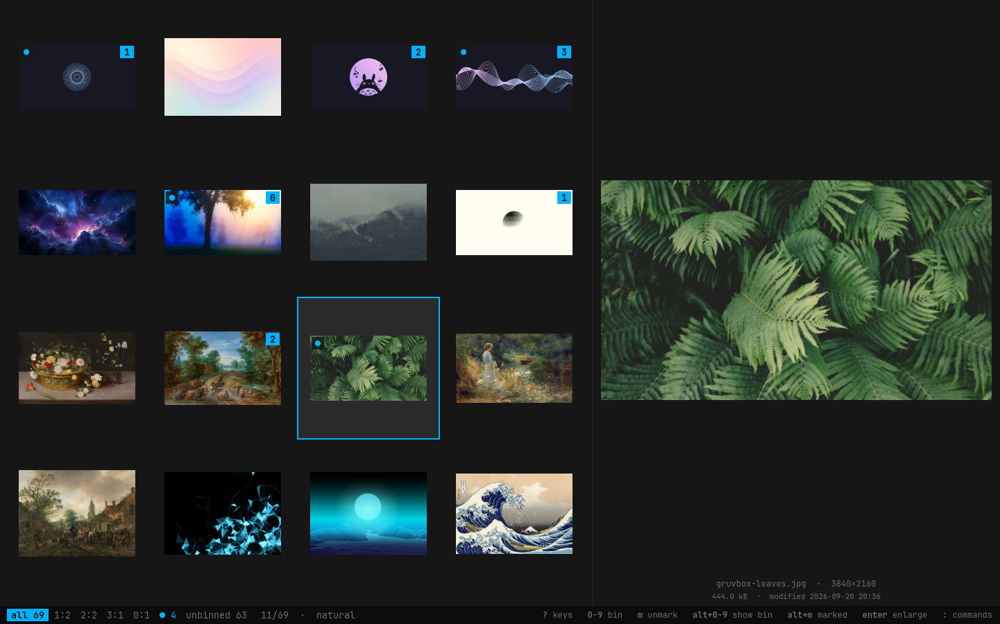

# omapic

A tiny, fast, keyboard-driven image viewer and *temporary* organizer for
[Omarchy](https://omarchy.org) / Arch Linux. Native Rust + GTK4, themed from
the active Omarchy theme.

The whole workflow:

    open images → inspect quickly → throw the interesting ones into numbered bins
                → optionally arrange a bin → run one explicit action on it

omapic is **not** a photo library, DAM, editor, EXIF tool or tagging system.
Nothing is persisted: bins and ordering live in memory and vanish when you
quit. Files are touched only when you run a command from the palette and
confirm it.

## Install

    sudo pacman -S --needed rust gtk4 imagemagick
    git clone https://github.com/tilman-schieber/omapic
    cd omapic
    cargo install --path .        # → ~/.cargo/bin/omapic

ImageMagick (`magick`) is only needed for contact sheets. JPEG, PNG, WebP,
GIF and TIFF are loaded through gdk-pixbuf/glycin, which GTK4 already pulls in.

## Usage

    omapic               # images of the current directory
    omapic image.jpg     # all images of that directory, image.jpg selected
    omapic DIR           # images of DIR
    omapic *.jpg …       # exactly the given files, in the given order

Hover or move the selection to preview. The right end of the status line
always hints at the keys that matter in the current context; `?` shows all.

### Keys

| Key | Action |
|---|---|
| arrows, `h` `j` `k` `l` | move around the grid |
| `Home` `End`, `g` `G` | first / last image |
| `Enter`, `Space` | enlarge preview (`Esc` to go back) |
| `z` | actual pixels at the pointer; drag to pan, position is kept from image to image |
| `1` … `9` | put the selected image into that workspace |
| `0` | take it out of its workspace |
| `v`, shift-click | mark a range; `1`…`9` / `0` then apply to all of it (one undo step) |
| `a` | auto-advance on/off: binning moves on to the next image |
| `Alt+1` … `Alt+9` | show only that workspace |
| `Alt+0` | show all images |
| `Alt+U`, ``Alt+` `` | show only what isn't binned yet — a worklist that empties as you go |
| `s` | manual sorting on / off for the current view |
| `Shift+←` `Shift+→`, `H` `L` | move the image backward / forward |
| drag a thumbnail | reorder |
| `u` / `U`, `Ctrl+R` | undo / redo binning, ordering and sort toggles (never file operations) |
| `f` | file names under thumbnails |
| `:` or `Ctrl+K` | command palette |
| `?` | key sheet |
| `q` | quit |

### Workspaces

Nine numbered bins. An image is in at most one; assigning it elsewhere moves
it, and it leaves the current view immediately if that view no longer
matches. Tagged thumbnails carry a numbered badge, and the status line lists
the non-empty bins with their counts.

Every view (each bin, and "all") is either in natural order — the order the
images were given or found, natural-sorted by name — or sorted by hand.
Reordering turns manual sorting on; `s` switches back to natural order and
remembers your arrangement in case you return. Reordering never renames
anything.

### Commands

All commands act on the images **currently shown**, in the order shown.

| Command | |
|---|---|
| Move workspace to folder… | asks for a folder (Tab completes, `~` works, created if missing) |
| Copy workspace to folder… | same, leaving the originals |
| Rename files in workspace according to current order… | in place: `001_name.jpg`, `002_…` |
| Create contact sheet… | output file, columns, thumbnail size, labels on/off → `magick montage` |
| Open containing folder | of the selected image |
| Remove selected image from workspace | same as `0` |

When a manually sorted view is moved or copied, omapic offers to persist the
order as numeric prefixes. The width fits the image count (at least three
digits), and an existing `NNN_` prefix is replaced rather than stacked.

### Safety

- Browsing, tagging and sorting never write anything, anywhere.
- Each file operation is planned in full and checked first: existing targets,
  two files mapping to one name, or missing sources abort it before the first
  file is touched.
- Nothing is ever overwritten; copies are created exclusively.
- In-place renames whose targets overlap their sources go through temporary
  names, and are rolled back if parking fails.
- Every operation needs an explicit `y`.
- There is no delete.

## Theming

Colours come from `~/.local/state/omarchy/current/theme/colors.toml` (or
`~/.config/omarchy/current/…` on older installs) and follow theme switches
while running. Without Omarchy a dark fallback palette is used. The font is
the system `monospace`. Layout and styling live in `src/style.css`.

The window is undecorated, as suits a tiling compositor. For Hyprland rules,
the window class is `org.omapic.Omapic`.

## Development

    cargo test         # model, CLI, file operations, montage argv, theme parsing
    cargo run -- ~/Pictures

    src/model.rs     session state: workspaces, filter, ordering (no GTK)
    src/cli.rs       arguments → image list, natural sort
    src/fsops.rs     the only code that modifies files: plan → check → execute
    src/montage.rs   `magick montage` invocation
    src/thumbs.rs    off-thread decoding, thumbnail worker pool
    src/quick.rs     ready-made thumbnails: XDG cache lookup, EXIF previews
    src/theme.rs     Omarchy colors.toml → GTK CSS, live reload
    src/ui/          window, grid cells, preview, palette, commands

Thumbnails come from worker threads, nearest-to-viewport first. Each image
is first looked up in the freedesktop thumbnail cache (`~/.cache/thumbnails`,
read but never written) and in its own EXIF data; an embedded preview is
shown at once and replaced by a proper decode afterwards. Thumbnails live in
a bounded in-memory cache; full-size previews are decoded only on demand.

Debug builds can be driven by a script for smoke tests, including rendering
the window to a PNG without a visible screen:

    OMAPIC_SCRIPT="l 1 l 2 alt+1 snap:/tmp/shot.png" cargo run -- DIR

See `src/ui/debug.rs` for the step syntax.

## License

[MIT](LICENSE)
