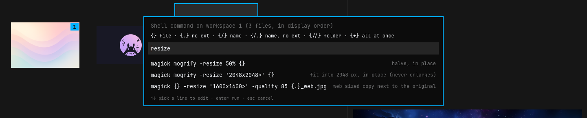

# omapic

A tiny, fast, keyboard-driven image viewer and *temporary* organizer for
[Omarchy](https://omarchy.org) / Arch Linux. Native Rust + GTK4, themed from
the active Omarchy theme.

The whole workflow:

    open images → inspect quickly → throw the interesting ones into numbered bins
                → optionally arrange a bin → run one explicit action on it

omapic is **not** a photo library, DAM, editor, EXIF tool or tagging system.
Nothing is persisted: bins and ordering live in memory and vanish when you
quit. Files are touched only when you run a command from the palette and
confirm it.

## Install

    sudo pacman -S --needed rust gtk4 libjpeg-turbo imagemagick wl-clipboard
    git clone https://github.com/tilman-schieber/omapic
    cd omapic
    cargo install --path .        # → ~/.cargo/bin/omapic

Or as a package, which also installs the desktop entry ("Open with omapic"
in file managers) and icon:

    cd pkg && makepkg -si      # add -d if your cargo comes from rustup/mise rather than pacman

Without the package, the desktop entry can be installed by hand:

    install -Dm644 data/org.omapic.Omapic.desktop -t ~/.local/share/applications/
    install -Dm644 data/org.omapic.Omapic.svg -t ~/.local/share/icons/hicolor/scalable/apps/

ImageMagick (`magick`) is only needed for contact sheets and the suggested
shell commands, `wl-clipboard` only to keep yanked paths after quitting.
JPEG, PNG, WebP, GIF (animated in the preview) and TIFF are supported.

## Usage

    omapic               # images of the current directory
    omapic image.jpg     # all images of that directory, image.jpg selected
    omapic DIR           # images of DIR
    omapic *.jpg …       # exactly the given files, in the given order
    omapic --print …     # on quit, print the paths of the images then shown

Hover or move the selection to preview. The right end of the status line
always hints at the keys that matter right now; `?` shows all of them.

Three ideas carry everything:

- **Bins** `1`…`9`, `0` — exclusive piles. Press a number to put the image in,
  the same number to take it out. **Marks** (`m`) are one extra flag on top,
  independent of the bins.
- **Views** — `Alt+number` shows one bin, `Alt+M` the marked images, `Alt+U`
  what isn't binned yet, `Esc` everything again. Each view can be arranged by hand.
- **Commands** (`:`) act on exactly what the current view shows, in the order
  shown — and they are the only thing that ever touches files.

## How do I…

**…cull a shoot?**
`omapic ~/Pictures/shoot`, then `a` (auto-advance) and go through: `1` keep,
`9` reject, anything else just `→`. `Enter` for a closer look, `z` for actual
pixels — the zoom position stays when you step to the next frame, so near-
duplicates are easy to compare. `u` takes back a slip. `Alt+U` shows what is
still undecided.

**…collect the keepers in a new folder?**
`Alt+1` to show the bin, `:` → *Move workspace to folder…* (or *Copy…*), type
the folder — it is created if it doesn't exist, `Tab` completes, `~` works —
check the preview of what will happen, `y`.

**…put images in a specific order and keep it?**
In the view you want to arrange: `H` / `L` (or `Shift+←/→`) move the image
back and forth, dragging a thumbnail moves it further. The status line says
`manual`. When you then move, copy or link the view, omapic offers to keep
the order as `001_name.jpg`, `002_…`; *Rename files in workspace according to
current order…* does the same in place. `s` switches back to natural order
(and remembers your arrangement).

**…pick the best across several bins?**
Mark them with `m` — marks don't disturb the bins. `Alt+M` shows the marked
images as a view of their own, with their own order, and every command works
on it.

**…act on a run of images at once?**
`v`, move to the other end (or shift-click), then a bin key, `m`, `r`, or `y`.

**…make a contact sheet?**
Show the bin, arrange it if you like, `:` → *Create contact sheet…*; `Enter`
through output file, columns, size and labels to accept the defaults.

**…batch-resize or convert a bin?**
`!`, type `resize` or `webp` to narrow the suggestions, `↓` `Enter` to take
one into the prompt, adjust, `Enter`, check the expanded commands, `y`.
New files the command creates show up in the session.

**…fix sideways photos?**
`r` / `R` turns them on screen; `:` → *Save rotations to files…* writes it
losslessly (EXIF orientation only, JPEG).

**…get rid of the rejects?**
`Alt+9`, `:` → *Move workspace to trash…*. It is the desktop trash, so
nothing is gone for good.

**…hand a bin to a shell pipeline without touching anything?**

    omapic --print *.jpg | xargs -d '\n' cp -t picked/     # quit while showing the bin

`--print0` for `xargs -0`. Inside omapic, `y` copies the selected paths and
`Y` all shown paths to the clipboard.

## Reference

### Keys

| Move around | |
|---|---|
| arrows, `h` `j` `k` `l` | move around the grid |
| `Home` `End`, `g` `G` | first / last image |
| `n` / `N` | next / previous binned image |

| Bin and mark | |
|---|---|
| `1` … `9`, `0` | put the image into that bin; the same key again takes it out |
| `m` | mark / unmark — independent of the bins |
| `v`, shift-click | select a range; bin keys, `m`, `r`, `y` then apply to all of it (one undo step) |
| `a` | auto-advance on/off: binning moves on to the next image |
| `u` / `U`, `Ctrl+R` | undo / redo binning, marking, ordering, rotating (never file operations) |

| Views | |
|---|---|
| `Alt+1` … `Alt+9`, `Alt+0` | show only that bin |
| `Alt+M` | show only the marked images |
| `Alt+U`, ``Alt+` `` | show only what isn't binned yet — a worklist that empties as you go |
| `Alt+A`, `Esc` | show all images |

| Arrange | |
|---|---|
| `Shift+←` `Shift+→`, `H` `L` | move the image backward / forward |
| drag a thumbnail | move it onto another position |
| `s` | manual order on / off for the current view |
| `o` | what unsorted views go by: natural → date taken → date modified → size → name |

| Look closer | |
|---|---|
| `Enter`, `Space` | enlarge the preview (`Esc` to go back) |
| `z` | actual pixels at the pointer; drag or `Shift`+arrows / `H J K L` pan; the position is kept from image to image |
| `r` / `R` | rotate right / left — in the session only, until saved from the palette |
| `i` | file and camera info (size, dates, camera, exposure) under the preview |
| `f` | file names under thumbnails |
| `+` / `-` | larger / smaller thumbnails |

| Act | |
|---|---|
| `:` or `Ctrl+K` | command palette |
| `!` | shell command on the images shown |
| `y` / `Y` | copy the path of the selected image(s) / of everything shown (kept after quitting via `wl-copy`, if installed) |
| `?` | key sheet |
| `q` | quit |

### Bins, marks and order

Ten numbered bins, `1`–`9` and `0`. An image is in at most one; pressing
its bin's key again takes it out, assigning it elsewhere moves it, and it
leaves the current view immediately if that view no longer matches. Binned
thumbnails carry a numbered badge, and the status line lists the non-empty
bins with their counts.

On top of the bins there is one non-exclusive set: **marks** (`m`, a dot on
the thumbnail). There is deliberately only one such flag — no ratings,
colours or tags.

Every view (each bin, the marked images, the unbinned ones, and "all") is
either in natural order — as given or found, natural-sorted by name, or
whatever `o` selects — or arranged by hand. Reordering turns manual order on
for that view only; it never renames anything.

### Commands

All commands act on the images **currently shown**, in the order shown.

| Command | |
|---|---|
| Move workspace to folder… | asks for a folder (Tab completes, `~` works, created if missing) |
| Copy workspace to folder… | same, leaving the originals |
| Symlink / Hard-link workspace into folder… | a selection folder without duplicating the data |
| Rename files in workspace according to current order… | in place: `001_name.jpg`, `002_…` |
| Create contact sheet… | output file, columns, thumbnail size, labels on/off → `magick montage` |
| Run shell command on workspace… (`!`) | anything, per file or over all files — see below |
| Move workspace to trash… | the desktop trash, so it is recoverable — e.g. bin 9 for rejects |
| Save rotations to files… | writes pending `r`/`R` rotations of the shown JPEGs |
| Open containing folder | of the selected image |
| Remove selected image from workspace | same as pressing its workspace key again |

When a manually sorted view is moved or copied, omapic offers to persist the
order as numeric prefixes. The width fits the image count (at least three
digits), and an existing `NNN_` prefix is replaced rather than stacked.

### Shell commands

`!` (or the palette) runs a shell command over the images shown, in display
order. Placeholders, already quoted for the shell:

| | |
|---|---|
| `{}` | the file — the command runs once per file, in the file's folder |
| `{.}` `{/}` `{/.}` `{//}` | path without extension · file name · name without extension · folder |
| `{+}` | all files at once — the command runs a single time, in the first file's folder |

    magick {} -resize '1600x1600>' {.}_web.jpg
    magick {+} images.pdf

Under the prompt omapic offers your earlier commands and a set of common
ImageMagick lines; type to narrow them down, pick one with the arrows and
`Enter` to get it into the prompt for editing, `Enter` again to go on. The
expanded commands are shown before anything runs. Afterwards thumbnails are
refreshed, images whose files are gone leave the session, and image files
the command created in those folders (`{.}_web.jpg`, `strip.jpg`, …) join it,
unbinned.

The history (`~/.local/state/omapic/shell-history`) is the only thing omapic
ever stores, and it holds commands, not anything about your images.

### Rotation

`r` and `R` turn the selected image (or selected range) like everything else in
omapic: on screen, in memory, undoable. The status line counts unsaved
rotations. *Save rotations to files…* makes them permanent, losslessly: only
the JPEG's EXIF orientation value is changed (two bytes, in place); a JPEG
without EXIF data gets a minimal EXIF block, and EXIF data that never
recorded an orientation gets the entry added without moving any of the
existing data. Image data is never re-encoded. JPEG only. Contact sheets
show pending rotations; move, copy and shell commands work on the files as
they are on disk.

### Safety

- Browsing, tagging and sorting never write anything, anywhere.
- Each file operation is planned in full and checked first: existing targets,
  two files mapping to one name, or missing sources abort it before the first
  file is touched.
- Nothing is ever overwritten; copies are created exclusively.
- In-place renames whose targets overlap their sources go through temporary
  names, and are rolled back if parking fails.
- Every operation needs an explicit `y`.
- omapic itself changes file contents only in *Save rotations* (the
  orientation value, nothing else). What a shell command does is up to you;
  you see exactly what will run before it does.
- There is no delete; the closest thing is the (recoverable) trash.

## Theming

Colours come from `~/.local/state/omarchy/current/theme/colors.toml` (or
`~/.config/omarchy/current/…` on older installs) and follow theme switches
while running. Without Omarchy a dark fallback palette is used. The font is
the system `monospace`. Layout and styling live in `src/style.css`.

The window is undecorated, as suits a tiling compositor. For Hyprland rules,
the window class is `org.omapic.Omapic`.

## Development

    cargo test         # model, CLI, file operations, montage argv, theme parsing
    cargo run -- ~/Pictures

    src/model.rs     session state: workspaces, filter, ordering (no GTK)
    src/cli.rs       arguments → image list, natural sort
    src/fsops.rs     the only code that modifies files: plan → check → execute; EXIF rotation
    src/montage.rs   `magick montage` invocation
    src/shell.rs     shell command templates: placeholders, suggestions, running
    src/history.rs   shell command history file
    src/thumbs.rs    off-thread decoding, thumbnail worker pool
    src/quick.rs     ready-made thumbnails: XDG cache lookup, EXIF previews
    src/exif.rs      minimal EXIF reader; orientation entry writer
    src/theme.rs     Omarchy colors.toml → GTK CSS, live reload
    src/ui/          window, grid cells, preview, palette, commands

Thumbnails come from worker threads, nearest-to-viewport first. Each image
is first looked up in the freedesktop thumbnail cache (`~/.cache/thumbnails`,
read but never written) and in its own EXIF data; an embedded preview is
shown at once and replaced by a proper decode afterwards. JPEGs are decoded
by libjpeg-turbo directly at reduced size (about 4× faster than decoding in
full); everything else goes through gdk-pixbuf. Thumbnails live in
a bounded in-memory cache; full-size previews are decoded only on demand.

Debug builds can be driven by a script for smoke tests, including rendering
the window to a PNG without a visible screen:

    OMAPIC_SCRIPT="l 1 l 2 alt+1 snap:/tmp/shot.png" cargo run -- DIR

See `src/ui/debug.rs` for the step syntax.

## License

[MIT](LICENSE)
